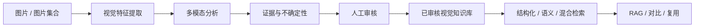
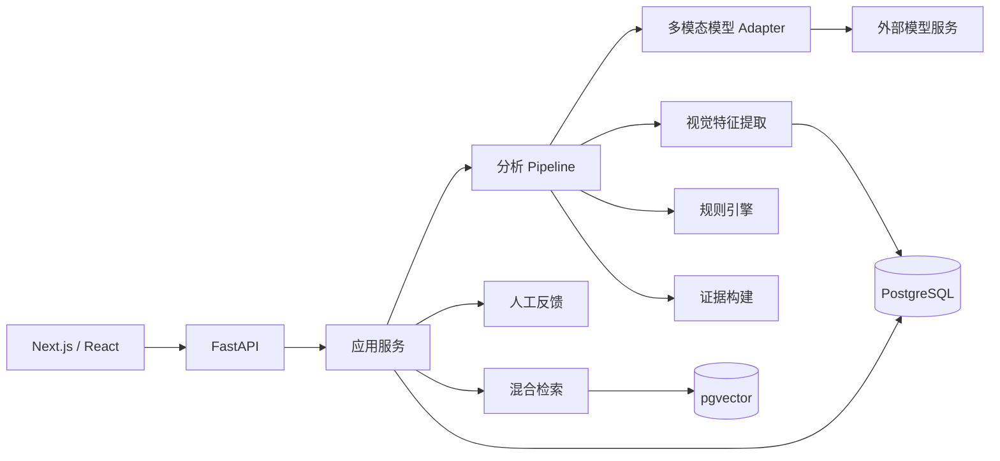

> **多模态视觉分析与知识检索平台**

AestheticLens 将图片中的**构图、色彩、光影、空间与风格**分析转化为可解释、可检索、可评测、可复用的视觉知识。

它不试图用一个脱离语境的总分回答“这张图美不美”，而是关注：

- 视觉机制
- 判断依据
- 不确定性
- 人工校准
- 视觉知识的检索和复用

---

## Demo 演示 （暂截图）

### 产品截图

1. 素材分析 / 五维结果


2. 视觉知识库


3. 检索 / 对比
实体约束：

语义约束：

高级筛选：

对比：


---

## 产品流程



核心原则：

> **AI 输出只是草稿，人工确认后的结果才成为可复用知识。**

---

## 核心能力

### 1. 五维视觉分析

系统从五个维度分析视觉素材：

- **构图**：主体布局、平衡、视觉动线、留白、框架关系
- **色彩**：主色、冷暖、饱和度、色彩对比与比例
- **光影**：亮度、对比、暗部、高光与光源线索
- **空间**：前中后景、深度、层次、拥挤或开阔感
- **风格**：风格标签、情绪、表达倾向及依据

底层视觉计算提供可重复的事实，多模态模型负责语义解释，两者分离保存。

---

### 2. 证据与不确定性

每个维度可同时保留：

- 可观察事实
- 视觉解释
- 证据引用
- 不确定性
- 改进建议

模型不能覆盖原始计算结果，只能引用和解释。

普通技术限制以次级信息展示；只有真正影响核心判断的不确定性才突出显示。

---

### 3. 人工参与审核

分析结果支持人工：

- 确认
- 修改
- 编辑风格标签
- 标记 Bad Case
- 将低价值案例排除在正式知识库之外

系统保留：

```text
AI 原始结果
→ 人工修订
→ 最终审核结果
```

人工修改不会覆盖原始模型输出，而是形成独立反馈与版本记录。

---

### 4. 视觉知识库

人工确认后的案例可沉淀为视觉知识资产，包括：

- 图片元数据
- 计算型视觉特征
- 五维分析结果
- 最终风格标签
- 证据
- 人工修订记录
- Embedding 向量

知识库采用轻量元数据与缩略图优先加载，完整分析与历史记录按需读取。

---

### 5. 检索与 RAG

AestheticLens 支持三类检索方式。

#### 结构化检索

适合明确条件，例如：

```text
风格 = cinematic
冷色比例 > 0.7
阴影占比 > 0.4
```

#### 语义检索

适合自然语言，例如：

```text
“安静、疏离、冷色调的画面”
```

#### 混合检索

结合结构化过滤与语义排序。

例如：

```text
“电影感的小猫”
```

可拆解为：

```text
猫 → 实体硬约束
电影感 → 语义排序
```

同时设置相关性阈值，避免为了凑满 Top-K 而返回明显弱相关结果。

RAG 只基于检索到的已审核案例回答；证据不足时允许拒答，而不是自由补全。

---

### 6. 图片集合与批量分析

系统支持多图 / 图片集合：

- 多图上传 / ZIP 导入
- 单项独立处理状态
- 部分失败
- 只重试未完成阶段
- 其他图片仍在处理时，可先审核已完成图片
- 集合级统计与汇总

外部分帧得到的图片也可作为有序图片集合导入；视频解码和自动抽帧不属于当前核心能力。

---

## 产品原则

### 计算事实与模型解释分离

- OpenCV / 传统视觉算法：计算事实
- 多模态模型：主体关系、情绪、风格等语义
- 规则引擎：显式条件判断
- 生成层：基于证据组织解释

### 所有结果可版本化

分析结果记录：

- 模型与供应商
- Prompt 版本
- 特征提取器版本
- 规则集版本
- Pipeline 版本
- 输出 Schema 版本

### 配置替代硬编码

维度、标签、阈值、Prompt、模型供应商与检索策略由配置管理，而不是散落在页面和业务代码中。

---

## Evaluation 与 Bad Case 闭环

AestheticLens 将真实使用中的错误作为产品迭代输入。

```text
发现问题
→ 记录
→ 分类
→ 定位原因
→ 修改 Prompt / 标签体系 / 检索 / UX
→ 回归验证
```

典型问题包括：

### 媒介感知不足

数字插画、平面设计已经明显不是摄影，但模型仍机械讨论真实曝光、物理纵深等问题。

### 过度不确定

模型已经观察到足够视觉证据，却因为无法证明作者真实意图而频繁输出“无法判断”。

### 代理指标压过语义主体

显著性等计算代理指标可能与人物、人脸、方向线等语义视觉线索冲突。

### 风格边界泄漏

例如：

```text
abstract ≠ expressionist
complex ≠ painterly
装饰性星月符号 ≠ surrealist
```

因此需要明确 Style Ontology 的支持条件、排除条件与易混淆边界。

### 检索边界问题

Top-K 只能表示“最多返回 K 条”，不代表必须凑满 K 条。

系统通过：

```text
相关性阈值
+ 实体硬约束
+ 语义排序
```

减少弱相关结果。

评测数据保留原始模型结果、人工修订和错误备注，用于后续 Prompt、标签体系与检索逻辑迭代。

---

## 系统架构



---

## 技术栈

### 前端

- TypeScript
- Next.js / React

### 后端

- Python
- FastAPI
- Pydantic
- PostgreSQL
- pgvector

### AI 与检索

- 多模态大模型
- Prompt Engineering
- Embedding
- 向量检索
- 结构化检索
- 语义检索
- 混合检索
- RAG
- Human-in-the-loop Evaluation

### 视觉计算

- OpenCV
- 亮度 / 明度
- 对比度
- 色相 / 色度统计
- 调色板 / Colorfulness
- 构图与空间代理指标

---

## 本地运行

### 1. 克隆仓库

```bash
git clone https://github.com/lizard970/aestheticlens-app.git
cd aestheticlens-app
```

### 2. 配置环境变量

复制仓库中的环境变量示例文件并创建本地 `.env`。


常见变量包括：

```text
AESTHETICLENS_DATABASE_URL
AESTHETICLENS_EMBEDDING_PROVIDER
AESTHETICLENS_EMBEDDING_MODEL
AESTHETICLENS_EMBEDDING_API_KEY
```

### 3. 启动后端

```bash
cd backend
python -m pip install -r requirements.txt
python -m app.migrate
python -m uvicorn app.main:app --reload --env-file ../.env --port 8000
```

### 4. 启动前端

进入包含 `package.json` 的前端目录：

```bash
pnpm install
pnpm dev
```

> 实际端口与环境变量以当前项目配置为准。

---

