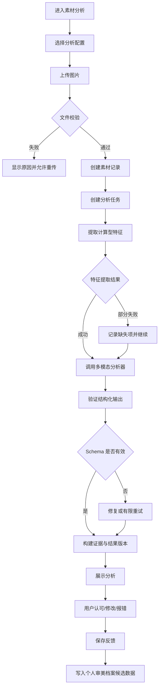
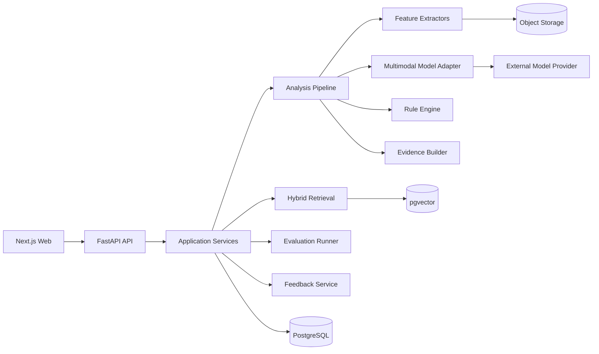
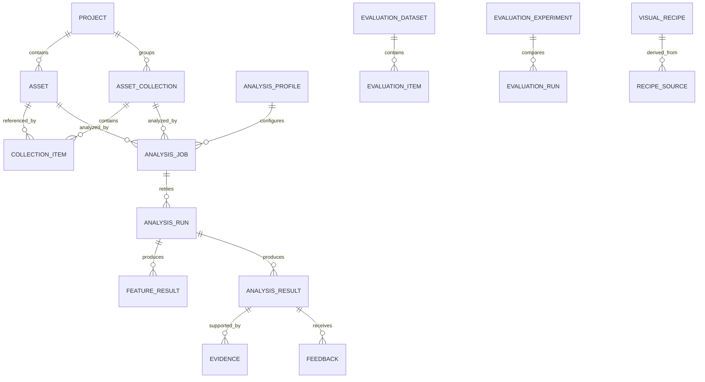

# AestheticLens 视觉素材美学分析与知识检索平台

> 产品调研与实现报告书 v0.2  
> 状态：已确认，作为当前产品与技术基线  
> 更新日期：2026-09-09

## 1. 执行摘要

AestheticLens 是一个面向内容创作者、AI 产品经理和美学评测人员的多模态产品。它将图片或图片集合中的构图、色彩、光影、空间和风格判断，转化为可解释、可检索、可评测、可复用的结构化知识。由视频预先分帧得到的图片可作为有序帧集合导入，但视频解码、自动抽帧和镜头检测不作为核心产品能力。

产品不是一个只给出“好不好看”分数的 AI 点评器。它需要形成以下闭环：

```text
导入图片或图片集合
→ 提取计算型特征
→ 生成有证据的美学分析
→ 用户确认、修改或否决
→ 沉淀视觉案例和个人偏好
→ 混合检索相似案例
→ 提炼视觉配方或生成 Skill
→ 评测新作品是否保留目标特征
```

第一阶段只实现单张图片的端到端闭环，但数据结构、服务边界和 API 从第一天支持未来的图片集合/帧集合、知识库、评测和视觉配方模块。

## 2. 产品目标与边界

### 2.1 产品目标

1. 帮助用户理解一个画面为什么有效或无效，而非只给结论。
2. 将主观美学判断拆分为计算特征、语义解释和综合判断三层。
3. 让分析结论可以追溯到图像区域、计算数据、参考案例和资料来源。
4. 建立数值筛选、语义检索和生成式解释协同工作的视觉知识库。
5. 通过人工反馈和对照实验评测分析系统自身的准确性、稳定性和实用性。
6. 最终将被认可的美学规律沉淀为可复用视觉配方、创作 Brief 或 Skill。

### 2.2 首要用户

- 正在进入 AI 产品领域，需要完整作品集的学习者；
- 负责多模态、美学评测或内容生成产品的 AI 产品经理；
- 需要积累和检索视觉参考的导演、摄影师、设计师及视频创作者；
- 需要形成团队审美规范的内容生产团队。

### 2.3 MVP 成功条件

用户能够在一个会话中完成：

1. 上传一张图片；
2. 查看基础视觉参数；
3. 获取五个维度的结构化分析；
4. 看见支持结论的证据；
5. 确认、修改或标记错误；
6. 保存后重新打开该分析；
7. 查看分析使用的模型、规则和提示词版本。

### 2.4 MVP 不做

- 内置视频解码、自动抽帧、镜头检测与视频时序分析；
- 自动训练或微调模型；
- 没有明确标注标准的综合美学排行榜；
- 复杂组织权限和多人审批；
- 大规模分布式任务调度；
- 将所有检索条件统一转成向量搜索。

## 3. 产品原则

### 3.1 证据先于分数

首版不提供一个脱离依据的总美学分。每个维度分别输出观察、判断、证据、不确定性和改进方向。总分只有在评分量表经过人工验证后才进入正式产品。

### 3.2 计算事实与模型解释分离

- OpenCV 等工具输出亮度、对比度、色彩占比等计算事实；
- 多模态模型理解主体关系、情绪和风格；
- 规则引擎检查结构化条件；
- 生成模型基于这些证据组织解释。

任何模型不得覆盖原始计算结果，只能引用或解释它。

### 3.3 所有结果可版本化

分析结果必须记录：模型、参数、提示词模板、特征提取器、规则集和流水线版本。用户修改产生新反馈记录，不直接篡改原始模型输出。

### 3.4 配置替代硬编码

美学维度、标签、阈值、提示词、模型供应商、检索策略和评分量表均通过配置或数据库管理。业务服务读取配置，不在控制器、页面或提示词中散落固定规则。

### 3.5 先完成单图闭环，再扩展图片集合

演进顺序固定为：

```text
单图 → 多图/图片包导入 → 单图流水线批量遍历
→ 集合级统计与聚类 → 集合总结 → 入库与检索
```

视频不是核心输入类型。若用户需要分析视频，可先在外部完成分帧，再将帧按顺序作为图片集合导入；集合项可选保存 `sequence_index`、`timestamp_ms` 等来源信息，以便保留基本顺序语义。未来如确有产品需求，可在导入层增加可替换的 `FrameExtractor` Adapter，但不要求改写后续分析、知识库和检索链路。

## 4. 核心使用场景

### 4.1 单帧美学诊断

用户上传画面，系统分析：

- 主体和视觉焦点；
- 构图关系与视觉动线；
- 色彩结构和冷暖关系；
- 光影、对比与层次；
- 空间、景深和画面复杂度；
- 风格、情绪和表达意图；
- 最有效的视觉机制；
- 潜在问题及可复用视觉配方。

### 4.2 图片集合与帧集合分析

用户一次通过多选上传或 ZIP 图片包导入多张图片，系统：

- 对每张图片复用同一套单图分析流水线；
- 支持批量进度、单项失败和部分成功；
- 汇总集合内的计算特征、标签与语义分布；
- 对集合内图片进行聚类，并识别代表样本与异常样本；
- 生成集合级总结，同时保留每张图的独立结果与证据；
- 将集合及其成员结果写入知识库，支持后续按集合、标签、数值和语义检索。

若集合来自视频，用户可在导入前使用外部工具完成分帧，并可选提供顺序或时间戳信息；本阶段不分析镜头边界、转场、节奏等时序关系。

### 4.3 视觉案例检索

支持三类请求：

- 结构化条件：“暗部占比大于 70%，暖色面积小于 15%”；
- 语义条件：“孤独、克制、具有窥视感的构图”；
- 混合条件：“暗部占比高，同时具有亲密感的双人镜头”。

### 4.4 分析方案对照评测

- A：多模态模型直接分析；
- B：多模态模型加计算型特征；
- C：多模态模型加计算型特征和参考案例。

比较三组方案的准确性、一致性、幻觉率、用户认可度、耗时和成本。

### 4.5 视觉配方复用

用户把已确认的案例提炼成结构化配方，再转换为创作 Brief、生成提示词或 Skill。生成结果回到同一套评测流水线验证。

## 5. 信息架构与页面原型

### 5.1 一级导航

1. 素材分析；
2. 批量素材与集合分析；
3. 视觉知识库；
4. 对比与检索；
5. 模型评测；
6. 审美档案与视觉配方；
7. 系统配置。

MVP 仅完整开放“素材分析”，其他入口展示能力说明、数据依赖和预计阶段，不使用伪造结果冒充已实现功能。

### 5.2 素材分析页

```text
┌────────────────────────────────────────────────────────┐
│ 顶栏：项目 / 分析配置 / 历史记录 / 当前任务状态       │
├───────────────────┬────────────────────────────────────┤
│                   │ 分析概览                           │
│ 图片预览          │ 主体 / 核心判断 / 不确定项         │
│                   ├────────────────────────────────────┤
│ 可切换证据覆盖层  │ 构图 / 色彩 / 光影 / 空间 / 风格   │
│                   │ 每项：观察、证据、判断、置信度     │
├───────────────────┴────────────────────────────────────┤
│ 计算特征：主色、亮度、对比度、暗部比例、复杂度……      │
├────────────────────────────────────────────────────────┤
│ 用户反馈：认可 / 修改 / 错误类型 / 备注 / 保存         │
└────────────────────────────────────────────────────────┘
```

### 5.3 页面状态

每个页面必须明确处理：

- 初始空状态；
- 上传中；
- 排队中；
- 计算特征中；
- 模型分析中；
- 部分成功；
- 完成；
- 可重试错误；
- 不可重试错误；
- 历史版本查看。

## 6. 用户流程

### 6.1 MVP 主流程



### 6.2 恢复流程

- 页面刷新后根据 `analysis_job_id` 恢复任务状态；
- 同一幂等键重复提交不会创建重复任务；
- 模型调用失败不会丢失已完成的计算特征；
- 用户可对失败阶段单独重试；
- 重试创建新的运行记录，保留旧错误用于评测和排障。

## 7. 美学分析框架

### 7.1 三层模型

| 层级 | 内容 | 主要来源 |
|---|---|---|
| 可观察事实 | 主体、位置、颜色、亮度、边缘、显著区域 | 程序计算与视觉模型 |
| 视觉语义 | 稳定、压迫、松弛、孤独、亲密、秩序等 | 多模态模型 |
| 综合判断 | 意图、有效机制、问题、配方、适用场景 | 基于前两层的解释 |

### 7.2 MVP 五个维度

| 维度代码 | 维度 | 最小输出 |
|---|---|---|
| `composition` | 构图 | 主体布局、平衡、动线、留白、框架关系 |
| `color` | 色彩 | 主色、冷暖、饱和度、色彩对比与比例 |
| `lighting` | 光影 | 亮度、对比、暗部、高光、光源方向线索 |
| `space` | 空间 | 前中后景、景深、层次、拥挤或开阔感 |
| `style` | 风格与情绪 | 风格标签、情绪、表达意图及依据 |

维度列表来自 `AnalysisProfile`，以后可以增加人物造型、剪辑、运动、声音等模块，而不修改核心任务结构。

### 7.3 单维度标准输出

```json
{
  "dimension_code": "composition",
  "observations": ["主体位于画面右侧"],
  "interpretation": "左侧留白形成视线等待感",
  "evidence_refs": ["region_subject_01", "metric_saliency_center"],
  "confidence": 0.78,
  "uncertainties": ["无法从静帧确认人物运动方向"],
  "suggestions": ["若要增强压迫感，可进一步压缩头顶空间"]
}
```

`confidence` 表示当前证据对该判断的支持程度，不代表作品质量分数。

## 8. 系统架构



### 8.1 分层职责

| 层 | 职责 | 禁止事项 |
|---|---|---|
| Web | 交互、状态展示、证据覆盖层 | 在页面中计算业务结论 |
| API | 鉴权、输入校验、协议转换 | 直接拼装模型提示词 |
| Application | 用例编排、事务、权限 | 依赖具体模型 SDK |
| Domain | 分析、反馈、评测的领域规则 | 依赖数据库或 Web 框架 |
| Infrastructure | 数据库、对象存储、模型、批量素材与可选媒体预处理适配 | 向上泄漏供应商结构 |

### 8.2 预留能力接口

```text
AssetIngestion           素材导入与校验
CollectionIngestion      图片集合/图片包导入
CollectionAggregator     集合级统计、聚类与总结编排
FrameExtractor           可选的外部视频分帧适配器（未来能力）
VisualFeatureExtractor   单项计算特征提取
MultimodalAnalyzer       多模态结构化分析
AestheticRuleEngine      配置化规则判断
EvidenceBuilder          证据引用与覆盖层构建
AnalysisPipeline         分析步骤编排
KnowledgeRepository      案例持久化
StructuredSearch         数值和标签筛选
SemanticRetriever        向量语义检索
HybridRetriever          混合排序
RAGAnswerGenerator       基于证据回答
FeedbackService          人工反馈记录
PreferenceProfile        审美偏好建模
RecipeGenerator          视觉配方提炼
SkillGenerator           Skill 输出
GenerationAdapter        生成模型适配
AestheticEvaluator       单样本评测
EvaluationDataset        评测集管理
EvaluationRunner         批量实验与指标汇总
ReportExporter           报告导出
```

未实现的接口返回明确的 `NOT_IMPLEMENTED` 能力状态，不返回伪造业务数据。

## 9. 核心数据模型

### 9.1 实体关系



### 9.2 关键实体

#### Project

- `id`：UUID；
- `name`；
- `description`；
- `owner_id`；
- `created_at`、`updated_at`。

#### Asset

- `id`：UUID；
- `project_id`；
- `asset_type`：`image`；
- `storage_uri`；
- `original_filename`；
- `mime_type`；
- `size_bytes`；
- `width`、`height`；
- `checksum_sha256`：去重与完整性；
- `source_metadata`：来源、作品名、版权备注等 JSON；
- `status`；
- `created_at`。

#### AssetCollection

- `id`：UUID；
- `project_id`；
- `name`；
- `collection_type`：`image_set | frame_set`；
- `source_metadata`：集合来源、说明、版权备注等 JSON；
- `status`；
- `created_at`。

#### CollectionItem

- `id`；
- `collection_id`；
- `asset_id`；
- `sequence_index`：普通图片集合可空，有序帧集合使用；
- `timestamp_ms`：外部分帧时可选提供；
- `source_metadata`：原文件名、来源路径等可选信息。

单张图片可直接作为分析目标；图片集合通过引用多个 `Asset` 形成批量分析目标。由视频外部分帧得到的图片只作为 `frame_set` 集合项处理，不要求系统内部维护视频对象。

#### AnalysisProfile

- `id`；
- `name`；
- `version`；
- `dimension_codes`；
- `feature_extractor_config`；
- `model_config_ref`；
- `prompt_template_ref`；
- `rule_set_ref`；
- `output_schema_version`；
- `is_active`。

#### AnalysisJob

- `id`；
- `target_type`：`asset | collection`；
- `target_id`；
- `analysis_profile_id`；
- `requested_by`；
- `status`：`queued | running | partial | succeeded | failed | cancelled`；
- `idempotency_key`；
- `created_at`、`completed_at`。

#### AnalysisRun

- `id`；
- `analysis_job_id`；
- `attempt_number`；
- `pipeline_version`；
- `started_at`、`completed_at`；
- `status`；
- `latency_ms`；
- `estimated_cost`；
- `error_code`、`error_detail`。

#### FeatureResult

- `id`；
- `analysis_run_id`；
- `extractor_code`；
- `extractor_version`；
- `feature_schema_version`；
- `values`：JSONB；
- `artifacts`：直方图、遮罩等引用；
- `status`；
- `error_detail`。

#### AnalysisResult

- `id`；
- `analysis_run_id`；
- `result_schema_version`；
- `summary`；
- `dimensions`：JSONB；
- `tags`；
- `visual_recipe_candidate`；
- `model_provider`、`model_name`、`model_version`；
- `prompt_template_id`、`prompt_version`；
- `raw_response_uri`；
- `created_at`。

#### Evidence

- `id`；
- `analysis_result_id`；
- `evidence_type`：`region | metric | feature | reference | citation`；
- `label`；
- `payload`：坐标、特征 ID、案例 ID 或引用；
- `supports_claim_ids`；
- `created_at`。

区域坐标采用归一化的 `0..1` 坐标，避免因图片缩放而失效。

#### Feedback

- `id`；
- `analysis_result_id`；
- `reviewer_id`；
- `feedback_type`：`accept | edit | reject | flag_error`；
- `target_path`：指向具体字段；
- `original_value`；
- `corrected_value`；
- `error_category`；
- `comment`；
- `created_at`。

#### EvaluationDataset

- `id`、`name`、`version`；
- `split_strategy`；
- `annotation_schema_version`；
- `status`：`draft | frozen | retired`；
- `created_at`。

#### VisualRecipe

- `id`；
- `name`；
- `version`；
- `intent`；
- `constraints`：结构化条件；
- `semantic_guidance`；
- `negative_constraints`；
- `source_analysis_result_ids`；
- `status`：`draft | validated | archived`。

## 10. API 契约 v1

统一前缀：`/api/v1`

### 10.1 通用规范

- ID 统一使用 UUID；
- 时间使用 ISO 8601 UTC；
- 请求和响应使用 `snake_case`；
- 写操作接受 `Idempotency-Key`；
- 列表使用游标分页；
- 长任务返回 `202 Accepted` 和任务资源；
- 错误响应具有稳定的机器错误码；
- API 不直接返回服务器本地文件路径，只返回受控资源 URL 或资源 ID。

错误结构：

```json
{
  "error": {
    "code": "UNSUPPORTED_MEDIA_TYPE",
    "message": "The uploaded file type is not supported.",
    "details": {"received": "image/tiff"},
    "request_id": "uuid"
  }
}
```

### 10.2 能力发现

#### `GET /capabilities`

返回当前部署已经实现的能力、版本和限制。前端据此控制入口，不把部署差异写死。

```json
{
  "capabilities": [
    {"code": "single_image_analysis", "status": "available", "version": "1.0"},
    {"code": "image_collection_analysis", "status": "not_implemented", "version": null}
  ]
}
```

### 10.3 项目与素材

| 方法 | 路径 | 用途 |
|---|---|---|
| `POST` | `/projects` | 创建项目 |
| `GET` | `/projects/{project_id}` | 获取项目 |
| `POST` | `/projects/{project_id}/assets` | 上传单张素材并创建记录 |
| `GET` | `/assets/{asset_id}` | 获取素材元数据 |
| `GET` | `/assets` | 按项目、类型、状态查询素材 |

图片集合接口在批量素材阶段实现，MVP 单图接口保持不变。

上传响应示例：

```json
{
  "id": "uuid",
  "project_id": "uuid",
  "asset_type": "image",
  "status": "ready",
  "media": {"width": 1920, "height": 1080},
  "created_at": "2026-09-06T08:00:00Z"
}
```

### 10.4 分析配置

| 方法 | 路径 | 用途 |
|---|---|---|
| `GET` | `/analysis-profiles` | 查询可用分析配置 |
| `GET` | `/analysis-profiles/{profile_id}` | 查看配置及版本 |
| `POST` | `/analysis-profiles` | 后续创建自定义配置 |

MVP 可以只提供系统默认 Profile，但前端仍通过 API 读取，不在代码中写死维度和阈值。

### 10.5 分析任务

#### `POST /analysis-jobs`

```json
{
  "target": {"type": "asset", "id": "uuid"},
  "analysis_profile_id": "uuid",
  "requested_outputs": ["features", "aesthetic_analysis", "evidence"]
}
```

响应：

```json
{
  "id": "uuid",
  "status": "queued",
  "progress": {"stage": "queued", "percent": 0},
  "links": {
    "self": "/api/v1/analysis-jobs/uuid",
    "result": "/api/v1/analysis-jobs/uuid/result"
  }
}
```

| 方法 | 路径 | 用途 |
|---|---|---|
| `GET` | `/analysis-jobs/{job_id}` | 查询任务进度及阶段错误 |
| `POST` | `/analysis-jobs/{job_id}/retries` | 创建新运行重试失败阶段 |
| `GET` | `/analysis-jobs/{job_id}/result` | 获取当前成功结果版本 |
| `GET` | `/analysis-jobs/{job_id}/runs` | 查看运行、模型、成本和错误历史 |

结果响应的顶层结构：

```json
{
  "result_id": "uuid",
  "job_id": "uuid",
  "schema_version": "1.0",
  "summary": {},
  "features": [],
  "dimensions": [],
  "evidence": [],
  "recipe_candidate": null,
  "provenance": {
    "pipeline_version": "1.0.0",
    "analysis_profile_version": "1.0",
    "model": {},
    "prompt": {},
    "extractors": []
  },
  "warnings": []
}
```

### 10.6 用户反馈

| 方法 | 路径 | 用途 |
|---|---|---|
| `POST` | `/analysis-results/{result_id}/feedback` | 保存认可、修改、拒绝或错误标记 |
| `GET` | `/analysis-results/{result_id}/feedback` | 查看反馈历史 |

```json
{
  "feedback_type": "edit",
  "target_path": "/dimensions/composition/interpretation",
  "corrected_value": "右侧主体与左侧留白形成等待感，而不是失衡感。",
  "error_category": "semantic_misinterpretation",
  "comment": "构图事实正确，但情绪解释不符合画面。"
}
```

### 10.7 未来接口，v1 路径现在锁定

| 模块 | 路径 |
|---|---|
| 图片集合 | `/projects/{project_id}/collections` |
| 集合成员 | `/collections/{collection_id}/items` |
| 集合分析 | `/collections/{collection_id}/analysis-jobs` |
| 结构化搜索 | `/search/structured` |
| 语义搜索 | `/search/semantic` |
| 混合搜索 | `/search/hybrid` |
| RAG 问答 | `/knowledge/answers` |
| 评测数据集 | `/evaluation-datasets` |
| 评测实验 | `/evaluation-experiments` |
| 视觉配方 | `/visual-recipes` |
| Skill 导出 | `/visual-recipes/{recipe_id}/skill-exports` |
| 生成任务 | `/generation-jobs` |
| 报告导出 | `/report-exports` |

锁定的是资源语义和边界，不锁死内部实现细节。正式实现某个未来模块前仍需补充该资源的请求、响应和状态机。

## 11. 配置与复用策略

建议的配置层级：

```text
系统默认配置
  → 部署环境覆盖
    → 项目配置
      → 单次分析请求覆盖（仅限允许字段）
```

配置文件或配置表至少覆盖：

- `analysis_dimensions`：维度及输出 Schema；
- `feature_extractors`：启用项、版本和参数；
- `model_profiles`：模型能力和调用参数；
- `prompt_templates`：模板正文与版本；
- `rule_sets`：规则、阈值和解释映射；
- `retrieval_profiles`：过滤、召回、融合与重排；
- `evaluation_rubrics`：指标和标注量表；
- `media_limits`：格式、尺寸、单集合数量和批量总大小限制。

硬编码检查规则：

1. API 控制器不得出现美学阈值；
2. React 组件不得维护独立标签列表；
3. 提示词不得在业务函数中以长字符串存在；
4. 模型供应商响应必须经过 Adapter 转换；
5. 数据库枚举只保存稳定状态，快速变化的标签使用配置表；
6. 所有输出 Schema 均显式带版本。

## 12. 模型评测设计

### 12.1 评测目标

| 维度 | 核心问题 | 指标示例 |
|---|---|---|
| 描述准确性 | 模型是否看对画面 | 属性准确率、关键对象遗漏率、幻觉率 |
| 规则一致性 | 明确规则能否稳定执行 | 重复运行一致率、人机一致率、分数方差 |
| 解释认可度 | 结论是否有足够证据且能帮助创作 | 盲评偏好、证据充分度、可操作性评分 |
| 产品效率 | 效果提升是否值得成本 | 延迟、单次成本、人工修订时间 |

### 12.2 数据集原则

- 按来源项目、作品或图片集合划分开发集、验证集和测试集；
- 同一来源集合中的高度相似图片或连续帧不得跨开发/验证/测试集合；
- 测试集冻结后不能用于修改提示词和规则；
- 每条标注保留标注者、量表版本和原始备注；
- 单人标注阶段只宣称“与个人判断的一致性”；
- 多标注者阶段增加标注者间一致性和分歧分析。

### 12.3 错误分类

- `object_hallucination`：编造对象；
- `attribute_error`：颜色、位置等事实错误；
- `composition_error`：构图关系错误；
- `unsupported_interpretation`：解释缺乏证据；
- `missed_key_signal`：遗漏关键视觉信号；
- `rule_violation`：没有遵守显式规则；
- `schema_failure`：结构化输出无效；
- `overconfidence`：证据不足但表达过强；
- `not_actionable`：建议泛化且无法用于创作。

## 13. 非功能需求

### 13.1 可追溯性

从任何展示结论都能追溯到：结果版本、运行记录、模型调用、提示词版本、特征结果和素材校验和。

### 13.2 可靠性

- 单个特征提取器失败可形成部分结果；
- 模型输出必须经过 Schema 验证；
- 重试具有次数和退避配置；
- 外部模型错误不得被转换成空的“成功结果”。

### 13.3 性能目标

首版以产品可用性目标管理，而不是过早承诺固定 SLA：

- 上传后立即展示本地预览；
- 任务进度按真实阶段更新；
- 基础特征应先于完整模型分析可见；
- 所有耗时和成本均进入运行记录，为后续优化提供基线。

具体延迟阈值在选定部署环境和模型后，通过基准测试确定，不凭空写死。

### 13.4 隐私与版权

- 上传时提示用户确认素材使用权限；
- 保存来源及版权备注；
- 原始图片、集合成员关系和模型输入可分别配置保留策略；
- 日志中不保存图片二进制和完整敏感提示；
- 删除策略在实现账号体系时单独设计并测试。

## 14. 埋点与产品指标

### 14.1 核心漏斗

```text
进入分析页
→ 选择素材
→ 上传成功
→ 创建分析任务
→ 查看完整结果
→ 展开证据
→ 提交反馈
→ 再次使用或检索历史案例
```

### 14.2 关键指标

- 分析任务成功率和部分成功率；
- 各阶段耗时与失败率；
- 结果查看率、证据展开率；
- 反馈提交率；
- 认可、修改、拒绝比例；
- 按维度统计的错误率；
- 用户完成一次有效分析所需时间；
- 重复使用率；
- 单次分析成本；
- A/B/C 方案的效果—成本差异。

埋点事件名称与属性由独立事件字典维护，页面不自由创造近义事件。

## 15. 实施路线与阶段验收

### 阶段 0：定义与骨架设计

当前文档即主要产物。完成条件：

- 产品目标、MVP 和非目标明确；
- 主流程与异常流程明确；
- 数据实体和版本关系明确；
- MVP API 和未来资源边界明确；
- 硬编码约束明确。

### 阶段 1A：可运行 UI 骨架

- 建立前后端目录；
- 能力发现和分析配置来自 API；
- 素材分析页具备全部状态；
- 使用明确标识的 mock adapter 演示完整交互；
- 不伪装成真实模型结果。

### 阶段 1B：真实计算特征

- 图片校验、对象存储和元数据入库；
- 亮度、对比度、主色、暗部/高光比例等真实计算；
- 特征提取器可独立注册和测试；
- 失败可降级并有运行记录。

### 阶段 1C：真实多模态分析

- 接入第一个模型 Adapter；
- 输出通过版本化 Schema 校验；
- 分析引用计算特征；
- 支持有限重试、错误展示、耗时和成本记录。

### 阶段 1D：证据与反馈闭环

- 结论引用证据 ID；
- 前端支持证据覆盖层；
- 用户可对具体字段反馈；
- 原始输出和人工修订分别保存；
- 历史结果可恢复。

后续依次进入知识库、评测、批量素材与帧集合、视觉配方和 Skill，不并行堆砌半成品模块。

## 16. 验收测试清单

MVP 至少覆盖：

1. 合法 JPG、PNG、WebP 上传；
2. 非法格式、超限文件、损坏文件；
3. 横图、竖图、极小图、透明图；
4. 重复上传与校验和去重策略；
5. 相同幂等键重复创建分析；
6. 单个特征提取器失败；
7. 模型超时和限流；
8. 模型返回非法 JSON；
9. 模型返回缺失字段；
10. 任务重试和页面刷新恢复；
11. 用户修改单字段和整项否决；
12. 旧版本结果在配置升级后仍可查看；
13. 未实现的图片集合和检索接口返回明确能力状态；
14. 任何结论都能找到其来源版本和证据引用。

## 17. 作品集与面试叙事

项目展示按“问题—决策—实验—结果”组织：

1. 为什么通用多模态模型的美学点评不够可用；
2. 如何拆分计算事实、语义解释和综合判断；
3. 为什么数值条件不能全部交给 Embedding；
4. 如何设计模型直出、计算增强、RAG 增强三组实验；
5. 如何通过人工反馈形成评测集，而不是只收集点赞；
6. 如何在效果、成本、延迟和可解释性之间做产品决策；
7. 如何从单图架构平滑扩展到图片集合与外部分帧集合，而不重写核心系统。

建议简历表达：

> 设计并实现多模态视觉素材美学分析与知识检索平台，将单图及图片集合中的构图、色彩、光影等主观判断转化为结构化标签、计算特征和可追溯证据；搭建模型直出、计算增强、RAG 增强三组评测实验，通过人工盲评、规则一致性和幻觉检测验证方案效果，并将确认案例沉淀为可复用视觉配方。

## 18. 已锁定决策

| 决策 | 当前选择 | 以后何时重新评估 |
|---|---|---|
| 产品切入点 | 单帧美学分析闭环 | 阶段 1D 完成后 |
| 前端 | Next.js / React | 原型性能或团队约束变化时 |
| 后端 | Python / FastAPI / Pydantic | 无需近期重评 |
| 数据库 | PostgreSQL，后续启用 pgvector | 进入知识库阶段前 |
| 媒体处理 | OpenCV；批量阶段增加图片集合导入与聚合，不将 FFmpeg 作为核心依赖 | 需要内置视频导入时再评估 |
| 模型接入 | Provider Adapter | 接入首个真实模型时选供应商 |
| 总美学分 | MVP 不提供 | 评分量表通过评测后 |
| 任务模式 | 异步、可恢复、可重试 | 保持 |
| 版本策略 | Profile、Schema、Prompt、模型、提取器分别版本化 | 保持 |

## 19. 下一步

下一步进入阶段 1A，先完成工程骨架与可运行交互原型：

1. 建立前端、后端、配置、测试和文档目录；
2. 定义 Pydantic API Schema 和领域接口；
3. 实现 `/capabilities`、分析配置、素材与分析任务的内存版服务；
4. 建立素材分析页面和任务状态流；
5. 使用明确标注的 Mock 分析器跑通上传—分析—反馈流程；
6. 添加自动化测试，证明接口可以替换为真实数据库和模型实现。

阶段 1A 不引入真实模型密钥，也不引入批量图片集合处理，以便先验证产品交互、数据契约和状态设计。
